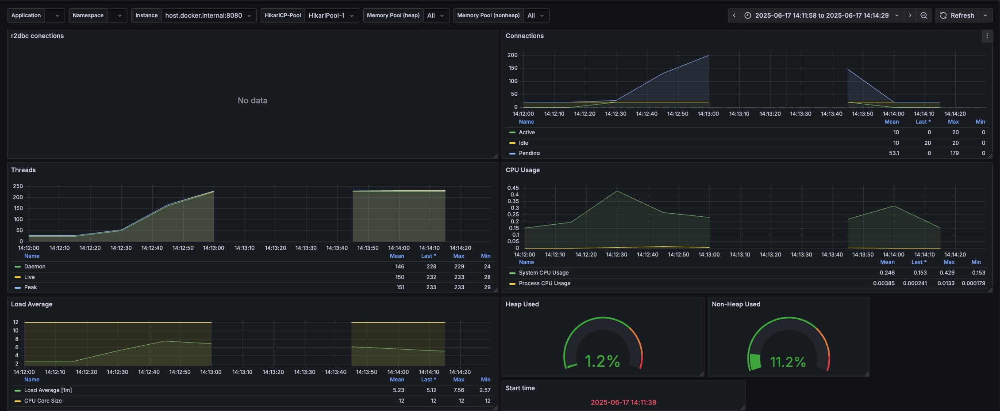
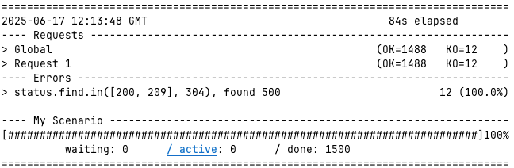
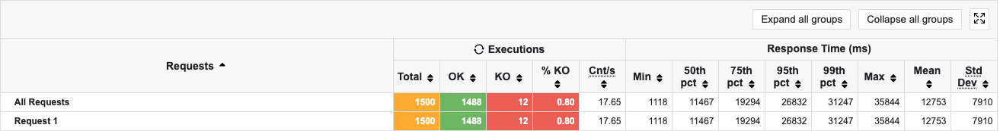
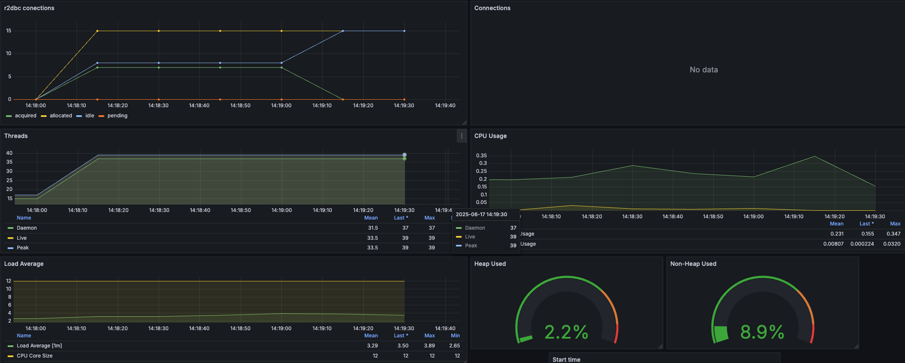
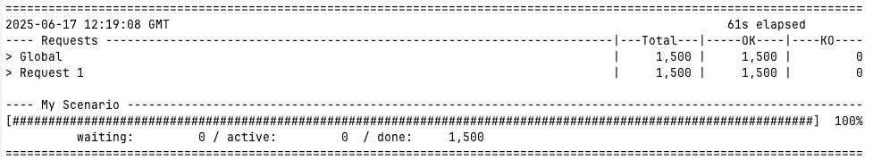
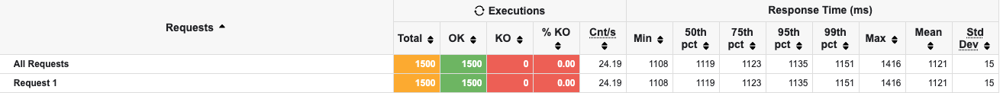
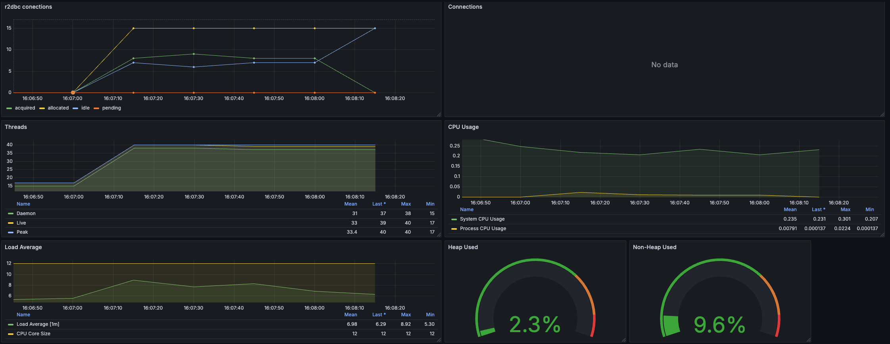
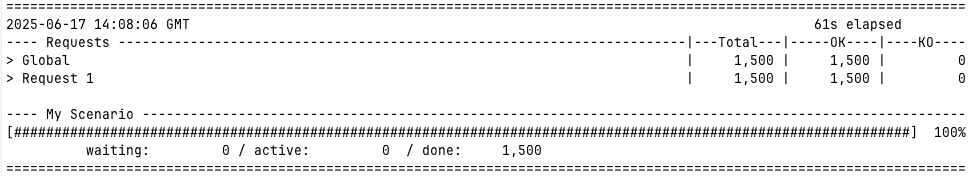
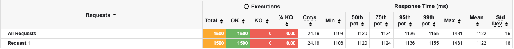

# springReactiveDemo

## general

This project was created to demonstrate how `reactive` can save an application from becoming unresponsive due to heavy load and slow backends.
There are three versions available:
  1. `demo` containing a simple spring-web application which calls another rest-api and a database
  2. `demoWebflux`, the same application using spring-webflux and r2dbc instead of spring-web and jdbc
  3. `demoCoroutines`, again the same application utilizing kotlin coroutines

There is one endpoint with a `GET` resource, which will query a database and with the result, calls a downstream API. The database and the downstream api will answer slow.
For the DB this is simulated by a view which sleeps for 100ms for each selected row. The downstream API is simulted by Wiremock, slowing down the response.  

In all three versions there is a docker compose file to ramp up all needed systems to simulate and monitor the load. This includes:
  1. MySql, the database being used
  2. [Wiremock](http://localhost:8080/portfolios/12345), to simulate the rest-api
  3. [Prometheus](http://localhost:9090/), for metrics collection
  4. [Grafana](http://localhost:3000/), for visualization (credentials admin/grafana)

## projects structure

### containers

Containing configuration for grafana (dashboard), prometheus and wiremock

**Following structure applies for each version (demo, demoWebflux, demoCoroutines)**

### src

#### controller

Holding the api endpoint, the controller calls two service, one querying the db and using the result to call another rest api

#### dto

holding data classes used

#### service

holding classes to call the database (`PortfolioService`) and one for the Rest API (`PriceService`)

##### db

stuff for database, like entities and repository

### src/test

there is a gatling test to simulate load, which can be executed by calling `mvn gatling:test`.

## Results

### DISCLAIMER: 

Results are from my dev machine and may not be 100% reproducible for you. So you might get to the same result,
or need to tweak the response times of the downstream services or play a bit with the gatling test.
For response time adjustments, you can edit the `normalResponse.json` in the `containers/wiremock` folder and the db migration 
`src/main/resources/db/migration/V1_0_0__Init.sql`, the `sleep` in line 15, which applies for each selected row!

### My results

From a single run each, results may vary a bit between runs, it's just to show what could be possible...

#### Classic spring-boot-web (`demo`)

Too many threads are used, at some point no more requests are processed in time. Management endpoints don't response in time anymore so missing data
points in grafana dashboard.

Threads are going up, and requests waiting for db connections from the pool which, at the end of the test run, leads to some errors.

#### spring-boot-webflux (`demoWebflux`)

Threads don't go up so high and also the connection pool is "relaxed" (max pool size of 20 is not reached). Management endpoints respond, so all data points are available.

No errors, and way better response times.

#### spring-boot-webflux with kotlin coroutines (`demoCoroutines`)

Similar result as with the webflux solution, but with imperative code more comparable to the classic spring-boot-web approach.

